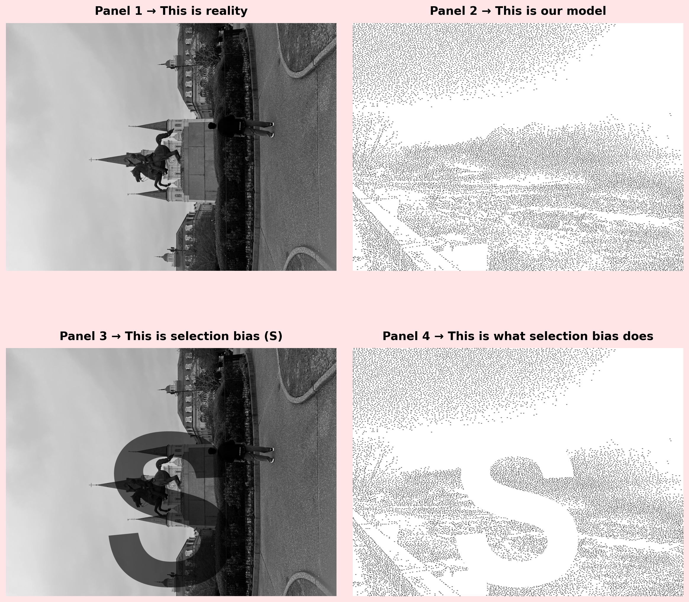

# The Meme Challenge

## The Four-Panel Meme

```{python}
#| label: create-meme
#| fig-width: 12
#| fig-height: 6
#| echo: false

import numpy as np
from PIL import Image, ImageDraw, ImageFont
import matplotlib.pyplot as plt
import matplotlib.patches as patches

# Load original image (your image from stipple challenge)
try:
    original_img = Image.open('IMG_6978.jpeg')
except FileNotFoundError:
    # Fallback to image_original.jpg if IMG_6978.jpeg doesn't exist
    try:
        original_img = Image.open('image_original.jpg')
    except FileNotFoundError:
        # If file doesn't exist, create a placeholder
        original_img = Image.new('L', (400, 400), 128)

if original_img.mode != 'L':
    original_img = original_img.convert('L')

# Get dimensions
height, width = original_img.size[1], original_img.size[0]
original_array = np.array(original_img, dtype=np.float32) / 255.0

# Load stipple image (your stipple image from Part 1)
# Try common filenames for stipple images
stipple_loaded = False
stipple_filenames = ['IMG_4950_stipple.png', 'image_stipple.png', 'stipple.png', 'stippleImage.png', 'IMG_6978_stipple.png']

for filename in stipple_filenames:
    try:
        stipple_img = Image.open(filename)
        if stipple_img.mode != 'L':
            stipple_img = stipple_img.convert('L')
        stipple_array = np.array(stipple_img, dtype=np.float32) / 255.0
        # Resize if needed to match original
        if stipple_array.shape != original_array.shape:
            stipple_img_resized = stipple_img.resize((width, height))
            stipple_array = np.array(stipple_img_resized, dtype=np.float32) / 255.0
        stipple_loaded = True
        break
    except FileNotFoundError:
        continue

if not stipple_loaded:
    # If stipple image doesn't exist, create a placeholder
    # This will work for testing, but you'll need your actual stipple image for the assignment
    stipple_array = np.ones((height, width), dtype=np.float32)
    # Add some random dots as placeholder
    np.random.seed(42)  # For reproducibility
    for i in range(0, height, 10):
        for j in range(0, width, 10):
            if np.random.random() > 0.5:
                stipple_array[i:i+2, j:j+2] = 0.0

# Create S mask - big bold S letter
s_mask = Image.new('L', (width, height), 255)  # White background
draw = ImageDraw.Draw(s_mask)

# Try to use a bold font, fallback to default if not available
try:
    # Try different font paths
    font_size = int(height * 0.85)
    try:
        font = ImageFont.truetype("/System/Library/Fonts/Supplemental/Arial Bold.ttf", font_size)
    except:
        try:
            font = ImageFont.truetype("/System/Library/Fonts/Helvetica.ttc", font_size)
        except:
            font = ImageFont.load_default()
except:
    font = ImageFont.load_default()

# Get text bounding box to center it
bbox = draw.textbbox((0, 0), "S", font=font)
text_width = bbox[2] - bbox[0]
text_height = bbox[3] - bbox[1]
x = (width - text_width) // 2
y = (height - text_height) // 2

# Draw bold S
draw.text((x, y), "S", fill=0, font=font)  # Black S

# Convert to array (0 = black, 1 = white)
s_mask_array = np.array(s_mask, dtype=np.float32) / 255.0

# Create image with S overlay for Panel 3
# Overlay S mask on original image - where S is black, show the S clearly
# This represents where the biased sampling occurs
s_overlay_array = original_array.copy()
# Where S mask is black (bias region), make S clearly visible
# Blend: show original image, but where S is, make it much darker to show the bias region
s_overlay_array = np.where(s_mask_array < 0.5, 
                           original_array * 0.4,  # Darken S region to show bias clearly
                           original_array)

# Create distorted stipple (stipple minus S-region)
# Where S is black (0), remove stipple (set to white/1)
distorted_array = np.where(s_mask_array < 0.5, 1.0, stipple_array)

# Save individual images
Image.fromarray((original_array * 255).astype(np.uint8)).save('image_original.jpg')
Image.fromarray((stipple_array * 255).astype(np.uint8)).save('image_stipple.png')
# Save S mask image (the S mask itself)
Image.fromarray((s_mask_array * 255).astype(np.uint8)).save('image_S_mask.png')
# Save S overlay image (original with S visible) - this is what Panel 3 shows
Image.fromarray((s_overlay_array * 255).astype(np.uint8)).save('image_S_overlay.png')
Image.fromarray((distorted_array * 255).astype(np.uint8)).save('image_distorted.png')

# Create 4-panel meme (2x2 layout)
fig, axes = plt.subplots(2, 2, figsize=(12, 12))
fig.patch.set_facecolor('#FFE5E5')  # Light pink background

# Panel 1: This is reality
axes[0, 0].imshow(original_array, cmap='gray', vmin=0, vmax=1)
axes[0, 0].set_title("Panel 1 → This is reality", fontsize=14, fontweight='bold', pad=10)
axes[0, 0].axis('off')

# Panel 2: This is our model
axes[0, 1].imshow(stipple_array, cmap='gray', vmin=0, vmax=1)
axes[0, 1].set_title("Panel 2 → This is our model", fontsize=14, fontweight='bold', pad=10)
axes[0, 1].axis('off')

# Panel 3: This is selection bias (S) - show image with S overlay
axes[1, 0].imshow(s_overlay_array, cmap='gray', vmin=0, vmax=1)
axes[1, 0].set_title("Panel 3 → This is selection bias (S)", fontsize=14, fontweight='bold', pad=10)
axes[1, 0].axis('off')

# Panel 4: This is what selection bias does
axes[1, 1].imshow(distorted_array, cmap='gray', vmin=0, vmax=1)
axes[1, 1].set_title("Panel 4 → This is what selection bias does", fontsize=14, fontweight='bold', pad=10)
axes[1, 1].axis('off')

plt.tight_layout(pad=2.0)
plt.savefig('meme_4panel.png', dpi=200, bbox_inches='tight', facecolor='#FFE5E5')
plt.close()

# Save the masked array data (required for part 3)
# Save as NumPy array
np.save('s_masked_data.npy', distorted_array)

# Also save as pandas DataFrame (alternative format)
try:
    import pandas as pd
    # Convert to DataFrame (flatten for storage)
    df_masked = pd.DataFrame(distorted_array)
    df_masked.to_csv('s_masked_data.csv', index=False)
    print("S-masked data saved as NumPy array (s_masked_data.npy) and CSV (s_masked_data.csv)")
except ImportError:
    print("S-masked data saved as NumPy array: s_masked_data.npy")
```



## Explanation of Selection Bias

Selection bias happens when the data we use is not representative of the population we care about. In my meme, the S shape removes part of the image before the model sees it, so the final output becomes distorted. This shows how biased samples can destroy the accuracy of our conclusions.
